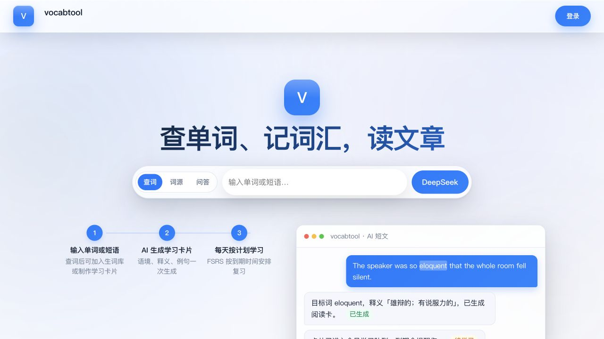

# VocabTool

**把查词、个人词库、学习卡片、间隔复习和语境阅读连成一条闭环的自部署英语学习应用。**

[在线体验](https://vocabtool.com) · [部署说明](#快速开始) · [参与贡献](CONTRIBUTING.md)

[](https://github.com/kami-mura/vocabtool-web/actions/workflows/ci.yml)
[](LICENSE)
[](pyproject.toml)



## 它解决什么问题

查到一个词并不等于记住一个词。VocabTool 把一次查询继续向后推进：

1. 查词、词源或英语问题，遇到生词就加入个人词库；
2. 从文章、文件、词表或学习目标中提取词汇，生成适合不同学习目的的卡片；
3. 用 FSRS-6 安排每天的新卡和到期复习；
4. 再用当天学习的词生成短文，在新语境中重新遇见它们。

应用可以完全自部署。账户、词库、卡片和复习记录保存在自己的 SQLite 数据库中；AI 默认连接 DeepSeek，也可以改用兼容 OpenAI 接口格式的服务。没有配置 AI Key 时，基础词典查询仍然可用。

## 主要特色

### 查词、词源与英语问答

- 三种查询模式：常规查词、词源速查、英语问题问答
- 返回核心释义、音标、词性、例句和词源信息，并支持拼写纠错
- 查询结果可以直接加入生词库；已收录、已制卡状态清晰可见
- 无 AI 配置时自动使用内置词典完成基础查询

### 四种学习卡片

| 类型 | 学习目标 | 卡片形式 |
| --- | --- | --- |
| 通用卡 | 记住词义和常见用法 | 单词 → 核心释义与例句 |
| 阅读卡 | 在文章中快速识别词义 | 语境句 → 目标词与释义 |
| Cloze 卡 | 从上下文主动提取 | 挖空例句 → 单词与释义 |
| 口语卡 | 把交际意图变成英文表达 | 中文表达需求 → 自然英文 |

制卡流程分为“选择卡片类型 → 提取目标词 → 生成卡片”，支持生成进度显示和生成前编辑词表。目标词可以来自：

- 粘贴的文章、文本、单词或短语
- TXT、Markdown、PDF、DOCX、EPUB、CSV、Excel、SQLite 文件
- 48 份内置词表，覆盖基础教育、四六级、考研、雅思、托福、GRE、学术、商务、医学、法律、编程等场景
- NGSL 31K 排名范围、随机抽取和个人生词库
- AI 按主题生成的词表
- 内置口语表达素材库

上传内容只用于提取目标词，正文不会保存到语料库中；还可以按 NGSL 排名范围二次筛选。

### FSRS-6 间隔复习

- 使用 FSRS-6 调度新卡、学习中卡片和到期卡片
- 支持“重来 / 困难 / 良好 / 简单”评分，并显示下一次复习间隔
- 可以撤回上一次评分、删除当前卡、暂时搁置卡片，或在完成今日任务后继续学习
- 每位用户可单独设置每日新卡数量
- 今日进度显示待复习、新学、已学习和连续学习天数
- 统计近 30 天复习量、评分分布、到期预测、延迟复习回忆率和 FSRS 记忆曲线

### 个人词库与卡片管理

- 用 Easy / Mid（已制卡）/ Hard（生词）管理学习状态
- 自定义“默认已认识”的 NGSL 排名范围
- 按内置词表、NGSL 范围或粘贴词表批量标记 Easy
- 卡片支持全文搜索，并可按进度、卡片类型、添加时间、字母或 NGSL 排名筛选排序
- 支持分页、批量选择、批量删除、搁置与恢复

### AI 语境阅读

- 使用当天新学的目标词生成一篇短文
- 在文章中高亮目标词，支持朗读和 Cloze 阅读模式
- 让刚复习过的词立即进入新的上下文，而不是停留在孤立释义中

### 发音、PWA 与多账户

- edge-tts 单词和例句发音，服务端缓存并预取即将学习的音频
- 可安装到手机或桌面的 PWA，提供离线兜底页面
- 响应式桌面/移动界面、深色模式和多套视觉皮肤
- 邮箱验证码注册、密码重置、HttpOnly 会话和用户数据隔离
- 可配置单用户上传空间、注册用户 AI 日限额和全站游客共享限额

## 快速开始

### Docker + SQLite

适合长期自部署：

```bash
git clone https://github.com/kami-mura/vocabtool-web.git
cd vocabtool-web
cp .env.example .env
# 编辑 .env（数据库默认 SQLite，落在 ./data，无需额外配置）
docker compose up -d --build
```

应用默认只监听 `127.0.0.1:8000`。可以使用仓库中的 [Caddyfile](Caddyfile) 配置 HTTPS，或在 `.env` 设置 Cloudflare Tunnel Token 后启动 tunnel profile：

```bash
docker compose --profile tunnel up -d
```

### 本地运行 + SQLite

适合体验和开发，无需单独安装数据库：

```bash
python -m venv .venv
source .venv/bin/activate
pip install -r requirements.txt
cp .env.example .env
uvicorn app.main:app --reload --port 8000
```

访问 <http://127.0.0.1:8000>。数据库默认使用 SQLite（`data/vocabflow.db`）。

## 配置

配置全部通过 `.env` 注入，完整说明和默认值见 [`.env.example`](.env.example)。常用变量如下：

| 变量 | 用途 |
| --- | --- |
| `DEEPSEEK_API_KEY` | AI 查词、问答、制卡和短文 |
| `DEEPSEEK_BASE_URL`、`DEEPSEEK_MODEL` | 切换兼容 OpenAI 接口格式的服务和模型 |
| `RESEND_API_KEY`、`EMAIL_FROM`、`VERIFICATION_SECRET` | 邮箱验证码和密码重置 |
| `NEW_CARDS_PER_DAY` | 默认每日新卡数量 |
| `DEFAULT_KNOWN_RANK` | 默认已认识的 NGSL 排名范围 |
| `AI_DAILY_REQUEST_LIMIT`、`GUEST_AI_DAILY_LIMIT` | 用户和游客 AI 日调用限额 |
| `MAX_UPLOAD_BYTES`、`USER_STORAGE_QUOTA_BYTES` | 单文件和单用户存储限制 |
| `ALLOWED_HOSTS`、`COOKIE_SECURE` | 生产域名和安全 Cookie 配置 |

不要提交 `.env`。正式环境应使用 HTTPS，设置真实 `ALLOWED_HOSTS`，并保持 `EMAIL_VERIFICATION_REQUIRED=true`。

## 技术栈与质量保障

- FastAPI、SQLAlchemy、Pydantic
- 原生 JavaScript、Jinja2、Service Worker；前端无需构建步骤
- SQLite
- [py-fsrs](https://github.com/open-spaced-repetition/py-fsrs)、DeepSeek / OpenAI 兼容接口、edge-tts
- pytest（246 个测试）、Ruff、Python compileall 和 JavaScript 语法检查
- GitHub Actions：Python 3.11 / 3.12、gitleaks 密钥扫描、pip-audit 依赖审计

本地验证：

```bash
pip install -r requirements-dev.txt
pytest tests -q
ruff check app tests
```

## 文档与项目说明

- [API 调用设计](docs/API调用设计.md)
- [FSRS-6 调度算法说明](docs/调度算法说明.md)
- [贡献指南](CONTRIBUTING.md)
- [安全问题报告方式](SECURITY.md)
- [第三方依赖、词表和视觉资产说明](THIRD_PARTY_NOTICES.md)

## License

程序代码采用 [MIT License](LICENSE)。仓库包含的第三方词表、依赖和视觉资产可能采用各自的许可，详见 [THIRD_PARTY_NOTICES.md](THIRD_PARTY_NOTICES.md)。
